<h2 align="center">CASOS PRÁCTICOS</h2>

## A) Versión de Nginx

Ejecutamos el comando _nginx -v_

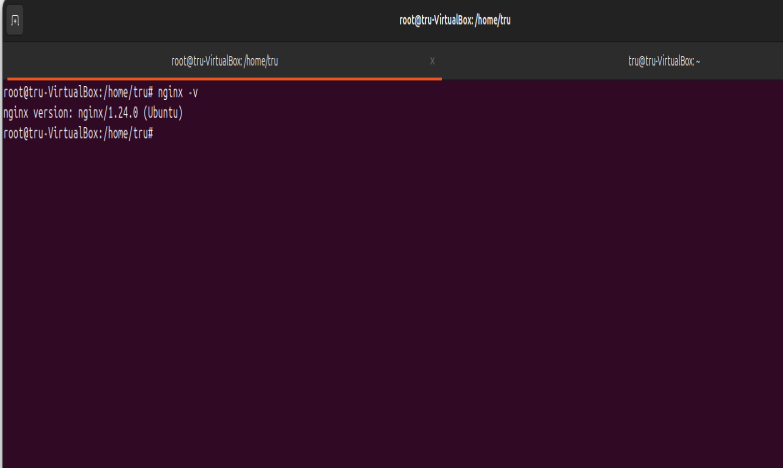

## B) Servicio asociado

Ejecutaremos _systemctl status nginx_ para comprobar que ha sido instalado correctamente y que está en funcionamiento.

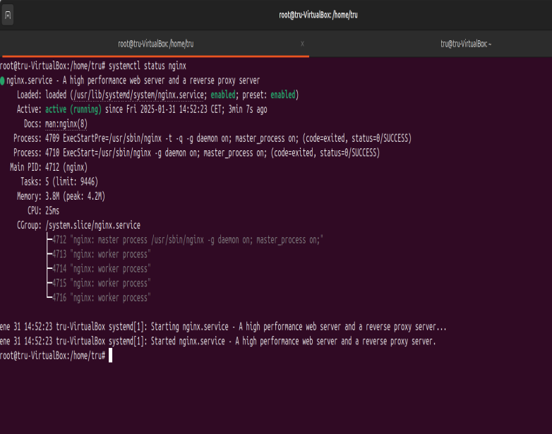

## C) Ficheros de configuración

El fichero está situado en _/etc/nginx_.

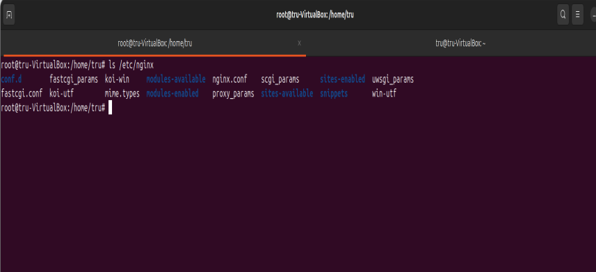

 

Se puede configurar en _/etc/nginx/nginx.conf_

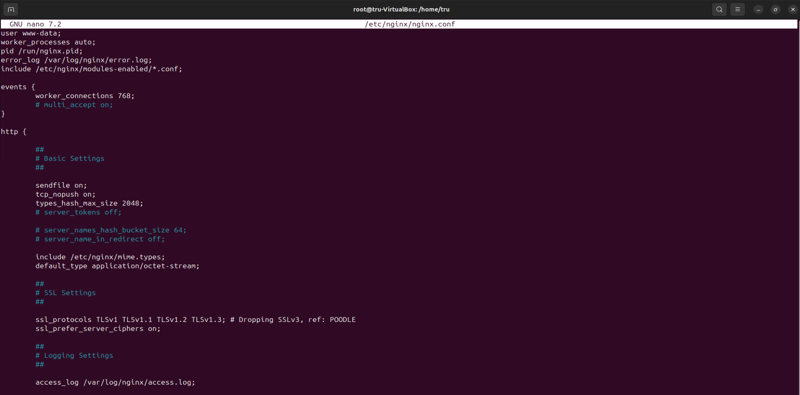

## D) Modificación de la página web

Para que no nos aparezca la página predeterminada de nginx, modificaremos el archivo que se encuentra en _/var/www/html/index.nginx-debian.html_

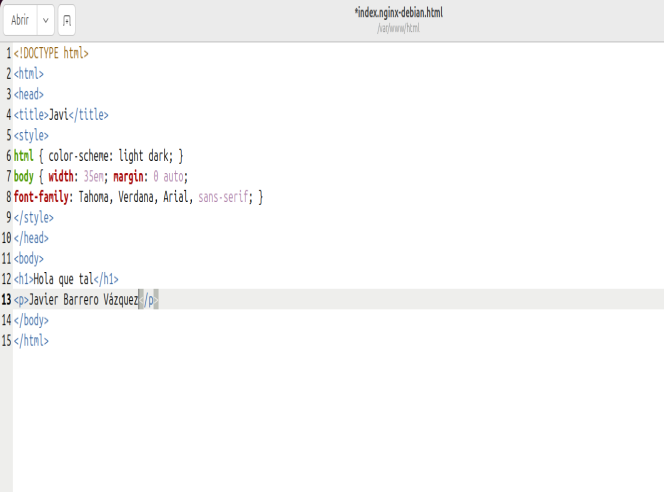

## E) Virtual hosting

Crearemos dos directorios para las dos webs.

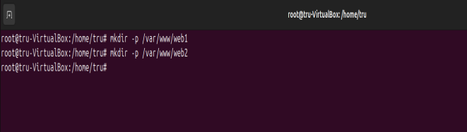

Le concedemos los permisos pertinentes a los directorios.

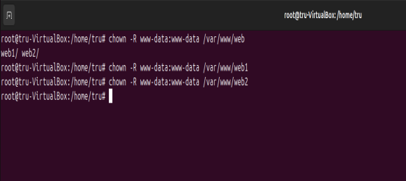

Crearemos el `index.html` para las dos páginas webs.

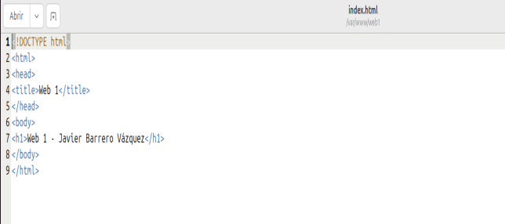

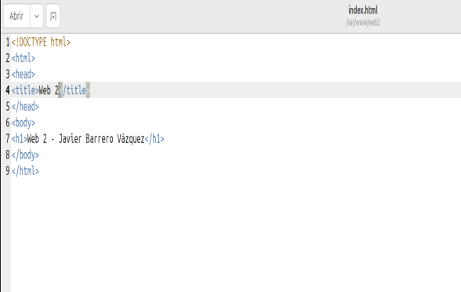

Crearemos los sites-availables para las webs.

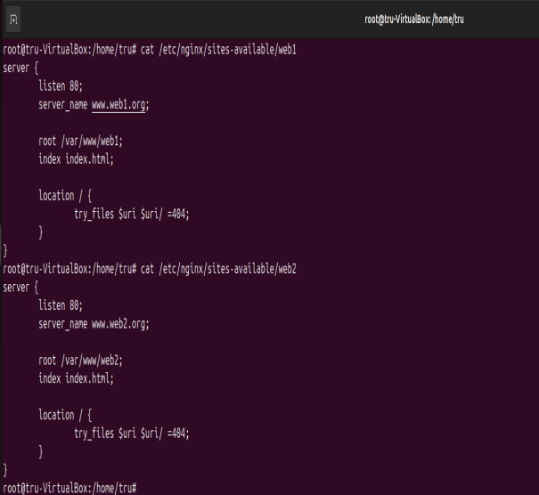

Configuraremos el archivo hosts para nuestras dos webs.

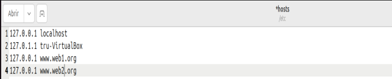

Finalmente, tendremos esto como resultado.

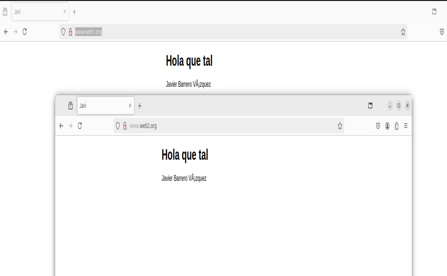

## F) Autenticación, autorización Y control de acceso

Le dotaremos a la web1 de conexión tanto interna como externa, sin embargo a la web2 le daremos solo conexión con la red interna.

Para conseguir este objetivo deberemos mofdificar los `sites-availabes` de cada uno como vemos en la imágenes.

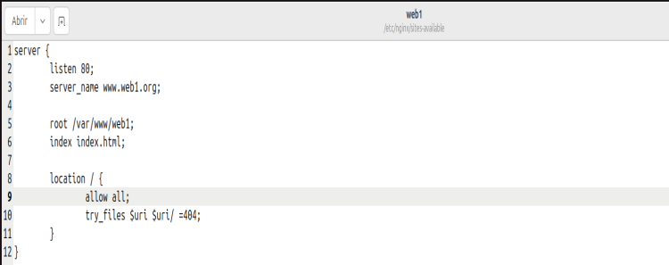

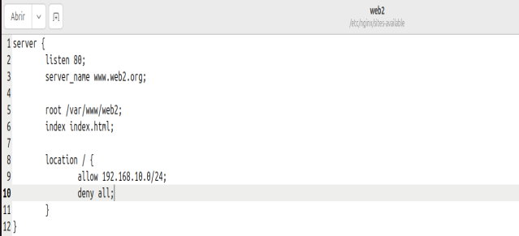

Modificaremos las ip's permitidas en el archivo hosts tanto para red interna como externa

Comprobaremos la red externa para saber si se ha realizado con éxito los cambios que hemos realizado con anterioridad.

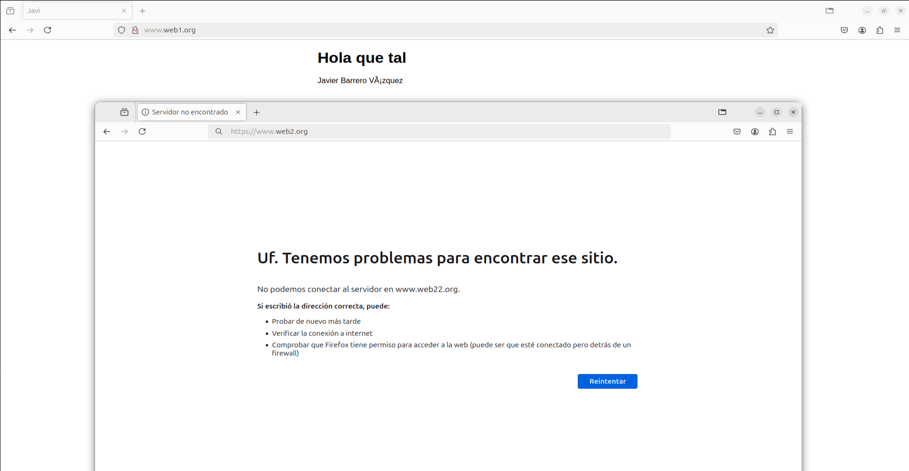

También comprobaremos la red interna mediante el comando `curl`

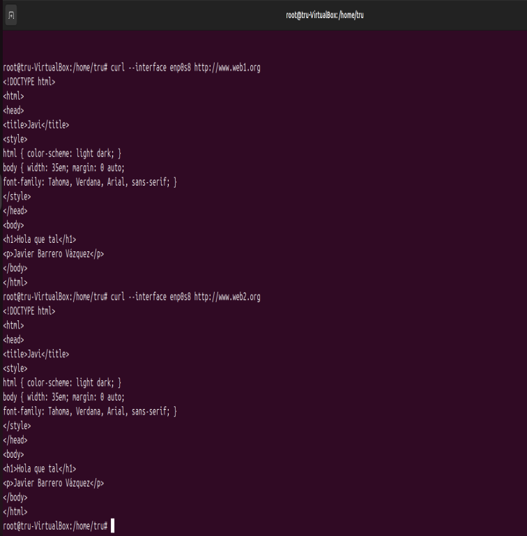

