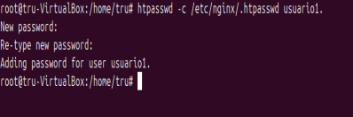
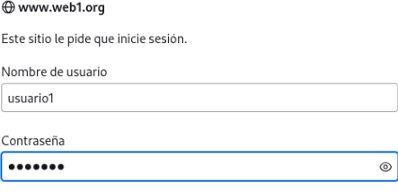
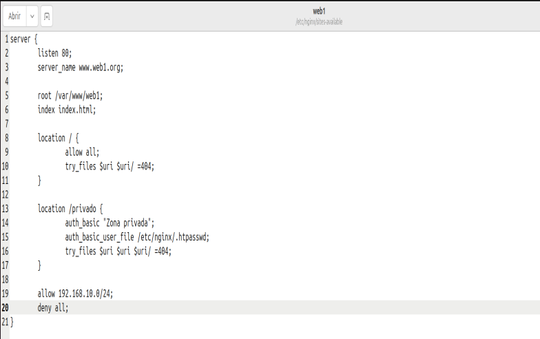
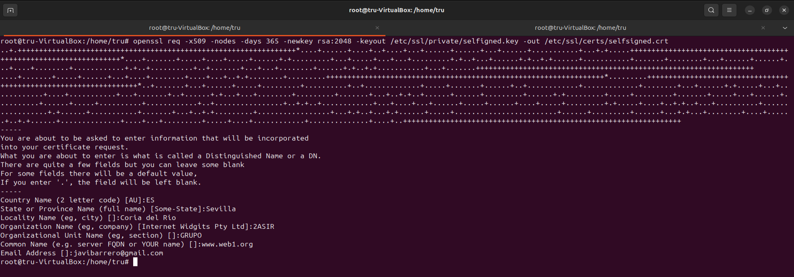
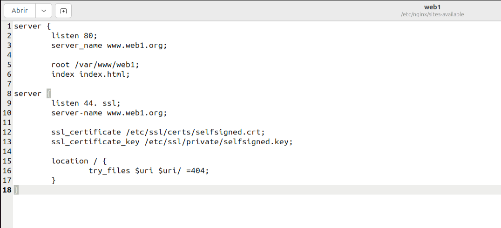

<h2 align="center">CASOS PRÁCTICOS</h2>

## A) Versión de Nginx

Ejecutamos el comando _nginx -v_

## B) Servicio asociado

Ejecutaremos _systemctl status nginx_ para comprobar que ha sido instalado correctamente y que está en funcionamiento.

## C) Ficheros de configuración

El fichero está situado en _/etc/nginx_.

 

Se puede configurar en _/etc/nginx/nginx.conf_

## D) Modificación de la página web

Para que no nos aparezca la página predeterminada de nginx, modificaremos el archivo que se encuentra en _/var/www/html/index.nginx-debian.html_

## E) Virtual hosting

Crearemos dos directorios para las dos webs.

Le concedemos los permisos pertinentes a los directorios.

Crearemos el `index.html` para las dos páginas webs.

Crearemos los sites-availables para las webs.

Configuraremos el archivo hosts para nuestras dos webs.

Finalmente, tendremos esto como resultado.

## F) Autenticación, autorización y control de acceso

Le dotaremos a la web1 de conexión tanto interna como externa, sin embargo a la web2 le daremos solo conexión con la red interna.

Para conseguir este objetivo deberemos mofdificar los archvios `web1` y `web2` dentro de `sites-availabes` de cada uno como vemos en la imágenes.

Modificaremos las ip's permitidas en el archivo hosts tanto para red interna como externa

Comprobaremos la red externa para saber si se ha realizado con éxito los cambios que hemos realizado con anterioridad.

También comprobaremos la red interna mediante el comando `curl`

## G) Autenticación, autorización y control de acceso

Configuraremos una autentificación básica para que sólo se pueda acceder mediante usuarios válidos.

Para ello primero deberemos crear el usuario utilizando el comando `htpasswd`.

Para ello deberemos modificar de nuevo el archvio `web1` dentro de `sites-availables`.

Por último accederemos a web1 mediante el navegador para asegurarnos que los cambios en el archivo de configuración de la web se han realizado con éxito, es decir que nos pida un usuario y una clave para poder acceder a dicha página.

## H) Autenticación, autorización y control de acceso

Web1 contiene un directorio llamado privado y desde la red externa nos pedirá una autorización pero desde la red interna no.

Para ello volveremos a modificar archvio `web1` dentro de `sites-availables`.

## I) Seguridad

Configuraremos el sitio web para que sea seguro mediante el uso del comando que vemos en la imagen.

Por último modificaremos el archvio `web1` dentro de `sites-availables`.

