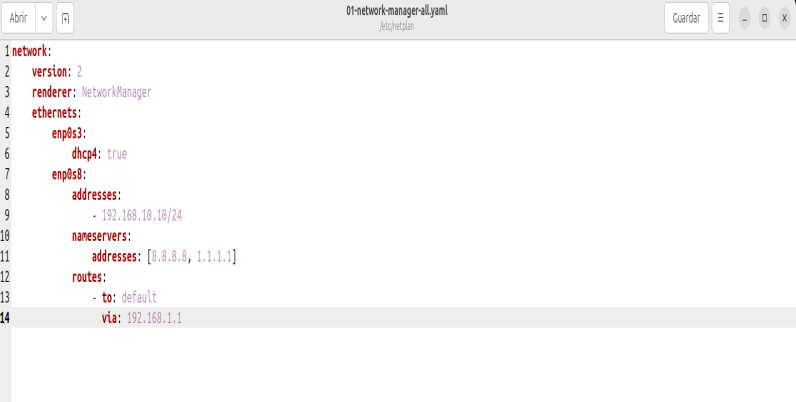
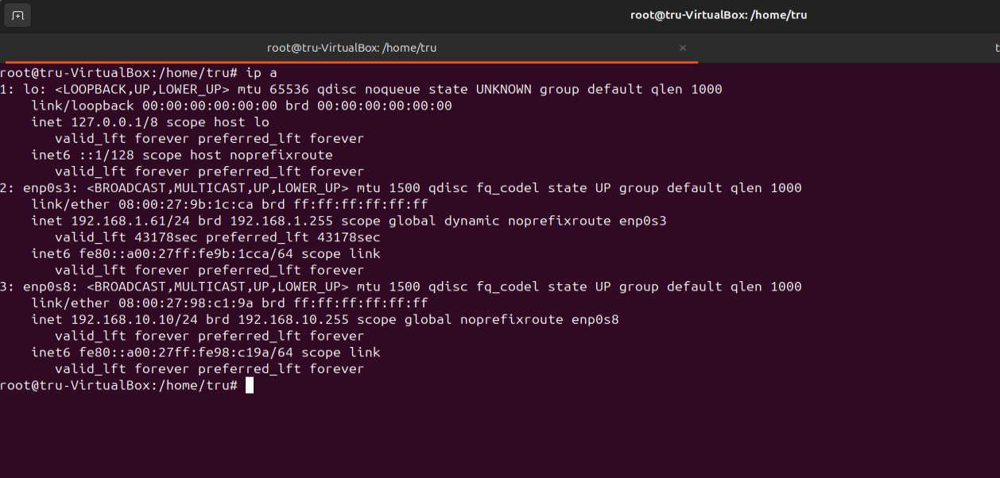

## Esquema de red 
El servidor está configurado con dos tarjetas de red:  
- La primera red corresponderá a la enp0s3 y tendrá adaptador puente.
- La segunda red corresponderá a la enp0s8 y tendrá red interna.
  
  

## Configuración de la red
Para configurar nuestra red deberemos entrar en nuestra máquina ubuntu y dirigirnos a la ruta /etc/netplan/01-network-manager-all.yaml

Una vez configurado nuestro archivo de red tendremos que ejecutar el comando _netplan apply_ y nos apareceran las dos tarjetas de red con la nueva configuración que le hemos indicado en el archivo anterior.

