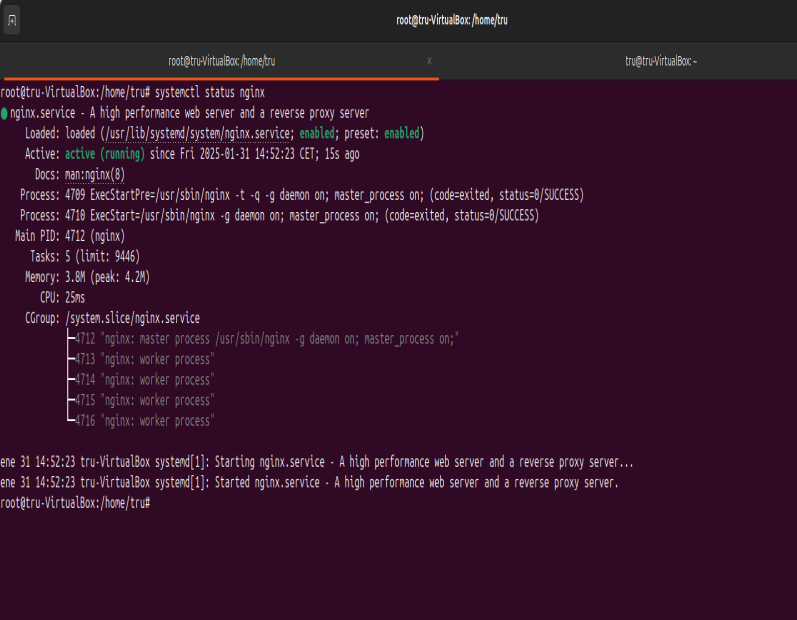

## Instalación de Nginx
Para instalar nginx deberemos ejecutar el comando _sudo apt install nginx_ en nuestro terminal linux.

Una vez instalado el nginx comprobaremos que está activo con un _systemctl status nginx_.

