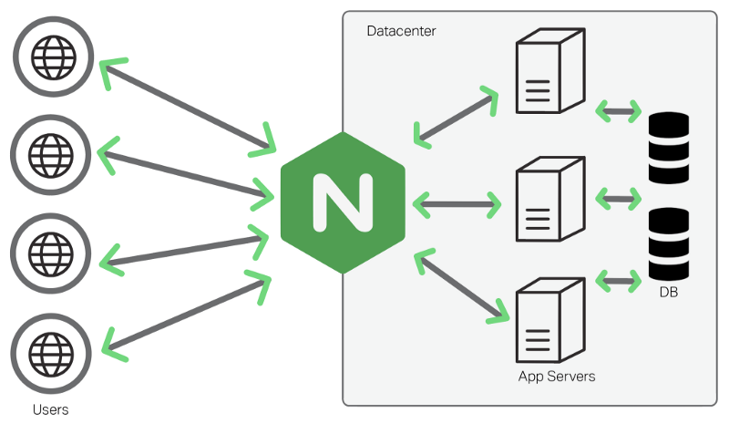

### ¿QUÉ ES NGINX?
NGINX es un servidor web de código abierto creado por Igor Sysoev en 2004, que ha logrado gran popularidad debido a su excelente capacidad para gestionar altos volúmenes de tráfico y ofrecer un rendimiento sobresaliente. Más allá de ser un servidor web, NGINX también desempeña funciones como proxy inverso, balanceador de carga y servidor de correo, lo que lo convierte en una herramienta clave en arquitecturas modernas gracias a su eficiencia y versatilidad. Su diseño está basado en un modelo asíncrono y no bloqueante, permitiéndole manejar miles de conexiones simultáneas de manera efectiva sin comprometer el rendimiento global del sistema. A diferencia de otros servidores web tradicionales, NGINX emplea un sistema de manejo de eventos que le permite ser altamente escalable y consumir pocos recursos, lo que lo hace ideal para sitios web con gran tráfico.

### CARACTERÍSTICAS PRINCIPALES DE NGINX
Una de las principales ventajas de NGINX es su habilidad para funcionar como servidor web, destacándose por su eficiencia en la entrega de contenido estático como HTML, imágenes y archivos multimedia. Esta capacidad de alto rendimiento lo convierte en una opción preferida para sitios web que necesitan garantizar una alta disponibilidad y velocidad de carga. Además, NGINX sobresale como proxy inverso, lo que le permite gestionar las solicitudes de los usuarios y redirigirlas de manera óptima a múltiples servidores backend, mejorando así el rendimiento de las aplicaciones y asegurando su disponibilidad. Al utilizar NGINX como balanceador de carga, las empresas pueden distribuir de manera equilibrada el tráfico entre varios servidores, lo que facilita la gestión de la carga y mantiene la estabilidad del sistema, incluso durante picos de tráfico.

### SEGURIDAD Y OPTIMIZACIÓN
La seguridad es otro aspecto fundamental en la configuración de NGINX, ya que permite establecer conexiones seguras mediante SSL/TLS, lo que asegura la protección de las comunicaciones entre los usuarios y los servidores. Además, NGINX puede ser configurado para proporcionar una capa adicional de protección contra ataques DDoS y otros riesgos de seguridad, actuando como una barrera frente a posibles amenazas. También ofrece soporte para el protocolo HTTP/2, lo que optimiza la velocidad de carga de las páginas web, y es compatible con WebSockets, facilitando la creación de aplicaciones en tiempo real que requieren una comunicación continua y bidireccional entre el servidor y el cliente.

### VENTAJAS DE UTILIZAR NGINX
Entre sus principales ventajas, NGINX sobresale por su excelente rendimiento, siendo capaz de gestionar miles de conexiones simultáneas sin un alto consumo de recursos, lo que se traduce en una mayor eficiencia y un menor uso de memoria en comparación con otros servidores web tradicionales. Su escalabilidad le permite adaptar las aplicaciones a medida que crecen, distribuyendo las solicitudes de manera efectiva entre varios servidores. Además, su diseño optimizado ayuda a reducir los costos operativos, ya que no necesita hardware de alto costo ni un uso excesivo de recursos para operar adecuadamente. La alta disponibilidad es otro de sus puntos fuertes, ya que gracias al balanceo de carga, asegura que las aplicaciones permanezcan accesibles para los usuarios, incluso en situaciones donde uno de los servidores backend pueda fallar o sufrir interrupciones.

